# Reglamento — Invocadores

> **Última actualización:** 2026-07-19 14:40 (Europe/Madrid)
>
> Este documento es la **fuente de verdad** del reglamento del juego de mesa
> «Invocadores», transcrito y organizado a partir del PDF de reglas más
> reciente. Está en Markdown para que sea fácil de editar directamente en
> GitHub cuando cambie alguna regla — no hace falta tocar el PDF original.
>
> Las imágenes de cada sección (`img/`) son las páginas originales del PDF,
> incluidas como referencia visual. Si el texto de una sección cambia, la
> imagen correspondiente puede quedar desactualizada — no hay que asumir que
> coinciden si ves un commit que solo toca el texto.
>
> ⚠️ **El simulador digital (`js/`) todavía no implementa todas estas reglas.**
> Ver `CLAUDE.md` para el detalle de qué está desactualizado.

---

## Índice

- [Introducción](#introducción)
- [Componentes](#componentes)
- [Objetivo del juego](#objetivo-del-juego)
- [Preparación](#preparación)
- [Secuencia de juego](#secuencia-de-juego)
- [Habilidades de los personajes](#habilidades-de-los-personajes)
- [Final de la partida](#final-de-la-partida)
- [Variantes y modos de juego](#variantes-y-modos-de-juego)
- [Glosario](#glosario)
- [Preguntas y respuestas frecuentes](#preguntas-y-respuestas-frecuentes)

---

## Introducción

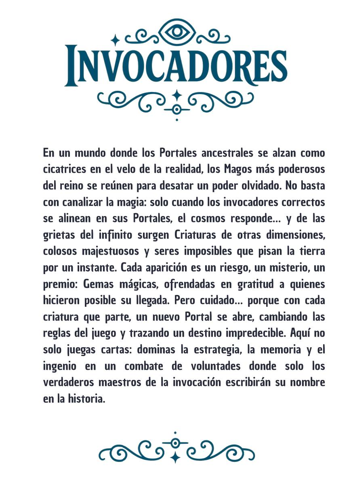

En un mundo donde los Portales ancestrales se alzan como cicatrices en el
velo de la realidad, los Magos más poderosos del reino se reúnen para
desatar un poder olvidado. No basta con canalizar la magia: solo cuando los
invocadores correctos se alinean en sus Portales, el cosmos responde… y de
las grietas del infinito surgen Criaturas de otras dimensiones, colosos
majestuosos y seres imposibles que pisan la tierra por un instante. Cada
aparición es un riesgo, un misterio, un premio: Gemas mágicas, ofrendadas en
gratitud a quienes hicieron posible su llegada. Pero cuidado… porque con
cada criatura que parte, un nuevo Portal se abre, cambiando las reglas del
juego y trazando un destino impredecible. Aquí no solo juegas cartas:
dominas la estrategia, la memoria y el ingenio en un combate de voluntades
donde solo los verdaderos maestros de la invocación escribirán su nombre en
la historia.

---

## Componentes

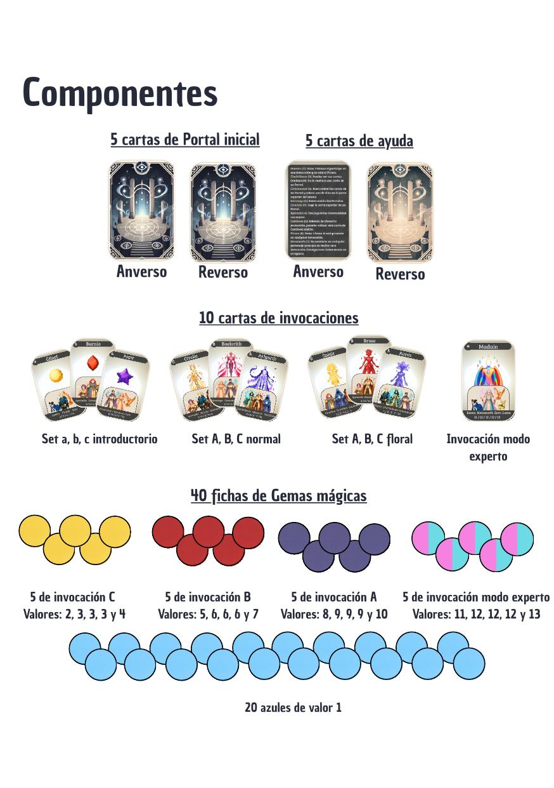

- **5 cartas de Portal inicial** (anverso/reverso)
- **5 cartas de ayuda** (resumen de reglas y habilidades)
- **10 cartas de invocación**: set a/b/c introductorio, set A/B/C normal, set
  A/B/C floral, e Invocación modo experto (Madain, marcada con \*)
- **40 fichas de Gemas mágicas**:
  - 5 de invocación C — valores 2, 3, 3, 3 y 4
  - 5 de invocación B — valores 5, 6, 6, 6 y 7
  - 5 de invocación A — valores 8, 9, 9, 9 y 10
  - 5 de invocación modo experto — valores 11, 12, 12, 12 y 13
  - 20 Gemas azules de valor 1 (Gemas unitarias)

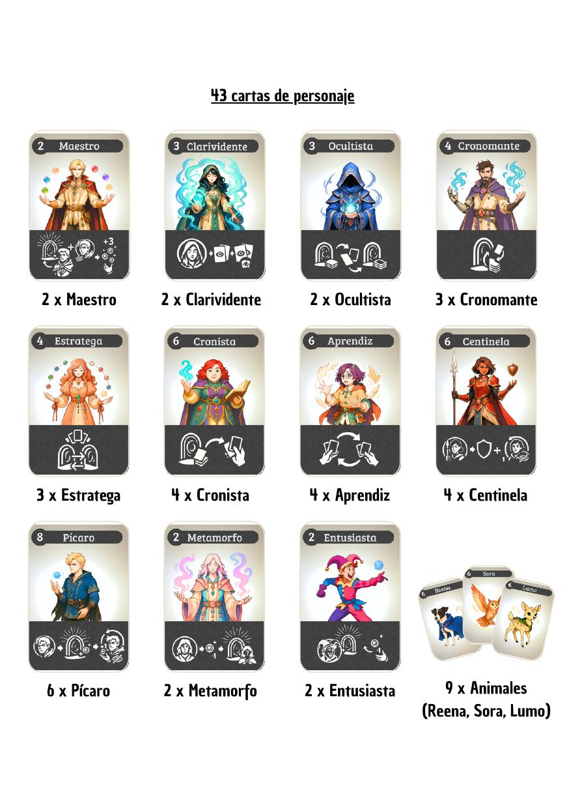

**64 cartas de personaje**: 2× Maestro, 3× Clarividente, 3× Ocultista, 4×
Cronomante, 4× Estratega, 6× Cronista, 6× Aprendiz, 6× Centinela, 8× Pícaro,
2× Metamorfo, 2× Entusiasta, 18× Animales (Reena, Sora, Lumo — 6 de cada).

---

## Objetivo del juego

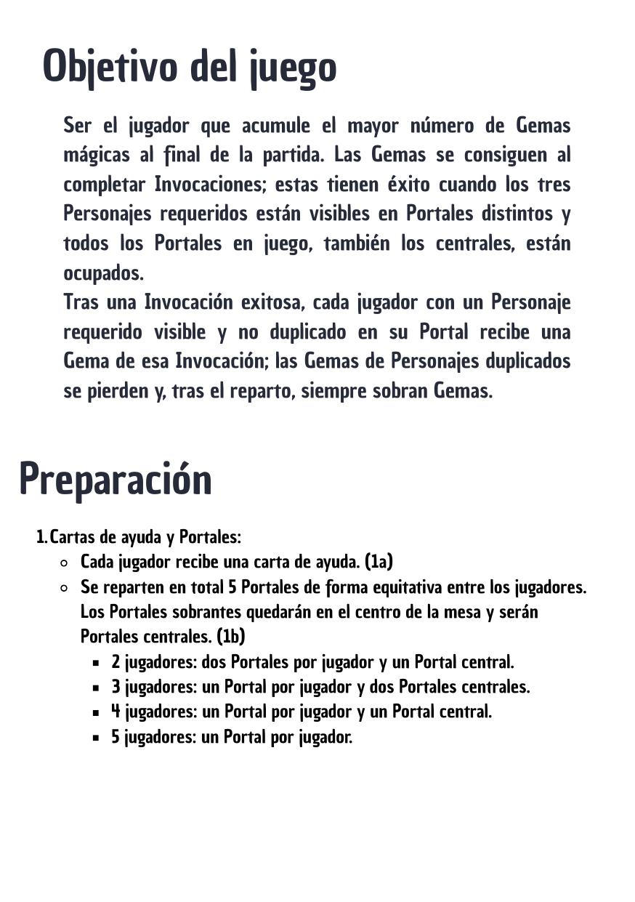

Ser el jugador que acumule el mayor número de Gemas mágicas al final de la
partida. Las Gemas se consiguen al completar Invocaciones; estas tienen
éxito cuando los tres Personajes requeridos están visibles en Portales
distintos y todos los Portales en juego, también los centrales, están
ocupados.

Tras una Invocación exitosa, cada jugador con un Personaje requerido visible
y no duplicado en su Portal recibe una Gema de esa Invocación; las Gemas de
Personajes duplicados se pierden y, tras el reparto, siempre sobran Gemas.

---

## Preparación

### 1. Cartas de ayuda y Portales

- Cada jugador recibe una carta de ayuda.
- Se reparten en total 5 Portales de forma equitativa entre los jugadores.
  Los Portales sobrantes quedan en el centro de la mesa como **Portales
  centrales**:

| Nº de jugadores | Portales por jugador | Portales centrales |
|---|---|---|
| 2 | 2 | 1 |
| 3 | 1 | 2 |
| 4 | 1 | 1 |
| 5 | 1 | 0 |

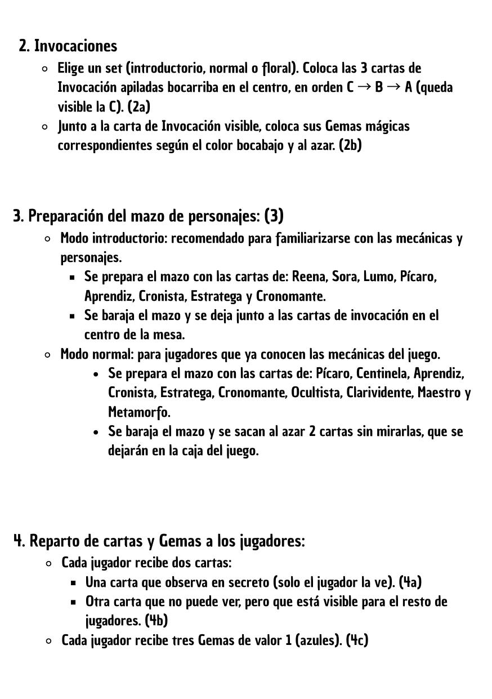

### 2. Invocaciones

- Elige un set (introductorio, normal o floral). Coloca las 3 cartas de
  Invocación apiladas bocarriba en el centro, en orden **C → B → A** (queda
  visible la C).
- Junto a la carta de Invocación visible, coloca sus Gemas mágicas
  correspondientes según el color, bocabajo y al azar.

### 3. Preparación del mazo de personajes

- **Modo introductorio** (recomendado para familiarizarse con las mecánicas
  y personajes): Reena, Sora, Lumo, Pícaro, Aprendiz, Cronista, Estratega y
  Cronomante. Se baraja y se deja junto a las cartas de invocación.
- **Modo normal** (para jugadores que ya conocen las mecánicas): Pícaro,
  Centinela, Aprendiz, Cronista, Estratega, Cronomante, Ocultista,
  Clarividente y Maestro. Se baraja, se sacan al azar 4 cartas sin mirarlas
  (se dejan en la caja), se introducen los 2 Metamorfo, se vuelve a barajar
  y se deja junto a las cartas de invocación.

### 4. Reparto de cartas y Gemas a los jugadores

- Cada jugador recibe dos cartas:
  - Una carta que observa en secreto (solo el jugador la ve).
  - Otra carta que no puede ver, pero que sí está visible para el resto.
- Cada jugador recibe tres Gemas de valor 1 (azules).

### Ejemplo de preparación de partida para tres jugadores

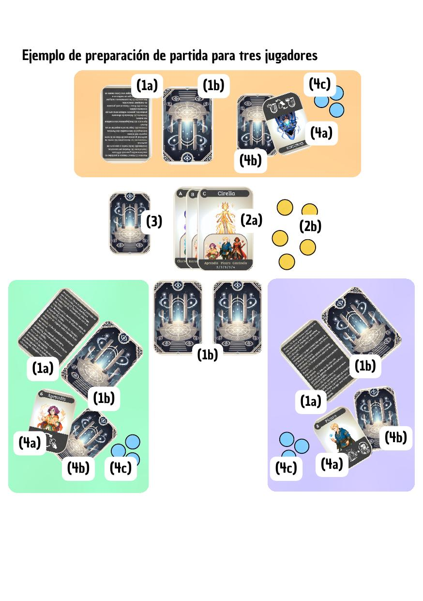

---

## Secuencia de juego

### Inicio de la partida

Comienza la persona que más recientemente haya tocado una Gema mágica. A
partir de ahí, el turno avanza en sentido horario.

Se recomienda recordar en voz alta qué personajes son necesarios para
completar la invocación activa (normalmente la de nivel C al inicio).

### Secuencia del turno

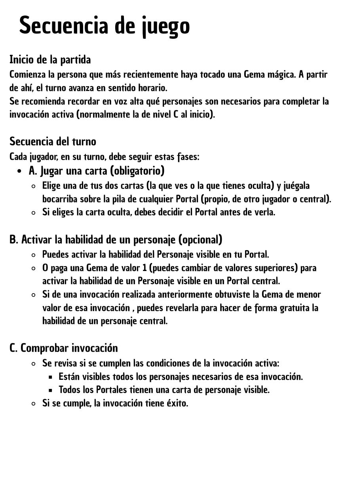

Cada jugador, en su turno, debe seguir estas fases:

**A. Jugar una carta (obligatorio)**
- Elige una de tus dos cartas (la que ves o la que tienes oculta) y juégala
  bocarriba sobre la pila de cualquier Portal (propio, de otro jugador o
  central).
- Si eliges la carta oculta, debes decidir el Portal antes de verla.

**B. Activar la habilidad de un personaje (opcional)**
- Puedes activar la habilidad del Personaje visible en tu Portal.
- O paga una Gema de valor 1 (puedes cambiar de valores superiores) para
  activar la habilidad de un Personaje visible en un Portal central.
- Si de una invocación realizada anteriormente obtuviste la Gema de menor
  valor de esa invocación, puedes revelarla para hacer de forma gratuita la
  habilidad de un personaje central.

**C. Comprobar invocación**
- Se revisa si se cumplen las condiciones de la invocación activa: están
  visibles todos los personajes necesarios de esa invocación, y todos los
  Portales tienen una carta de personaje visible.
- Si se cumple, la invocación tiene éxito.

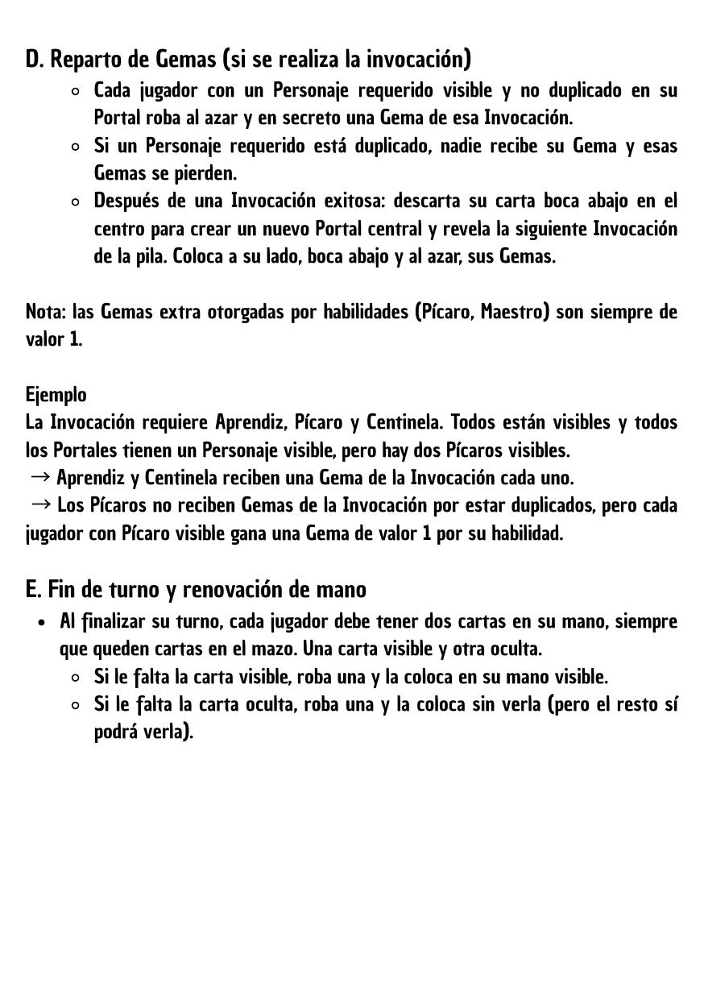

**D. Reparto de Gemas (si se realiza la invocación)**
- Cada jugador con un Personaje requerido visible y no duplicado en su
  Portal roba al azar y en secreto una Gema de esa Invocación.
- Si un Personaje requerido está duplicado, nadie recibe su Gema y esas
  Gemas se pierden.
- Después de una Invocación exitosa: descarta su carta boca abajo en el
  centro para crear un nuevo Portal central y revela la siguiente Invocación
  de la pila. Coloca a su lado, boca abajo y al azar, sus Gemas.

> **Nota:** las Gemas extra otorgadas por habilidades (Pícaro, Maestro) son
> siempre de valor 1.

> **Ejemplo:** la Invocación requiere Aprendiz, Pícaro y Centinela. Todos
> están visibles y todos los Portales tienen un Personaje visible, pero hay
> dos Pícaros visibles. → Aprendiz y Centinela reciben una Gema de la
> Invocación cada uno. → Los Pícaros no reciben Gemas de la Invocación por
> estar duplicados, pero cada jugador con Pícaro visible gana una Gema de
> valor 1 por su habilidad.

**E. Fin de turno y renovación de mano**
- Al finalizar su turno, cada jugador debe tener dos cartas en su mano,
  siempre que queden cartas en el mazo. Una carta visible y otra oculta.
  - Si le falta la carta visible, roba una y la coloca en su mano visible.
  - Si le falta la carta oculta, roba una y la coloca sin verla (pero el
    resto sí podrá verla).

---

## Habilidades de los personajes

### Modo introductorio

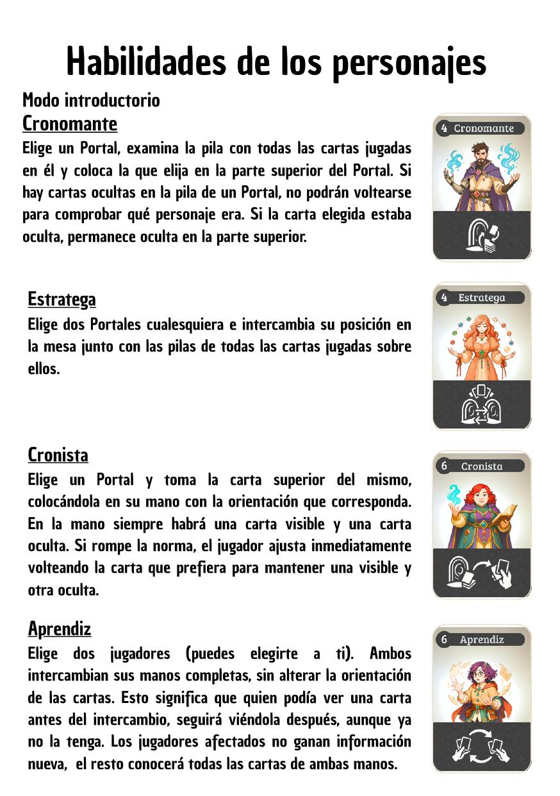

**Cronomante** — Elige un Portal, examina la pila con todas las cartas
jugadas en él y coloca la que elija en la parte superior del Portal. Si hay
cartas ocultas en la pila de un Portal, no podrán voltearse para comprobar
qué personaje era. Si la carta elegida estaba oculta, permanece oculta en la
parte superior.

**Estratega** — Elige dos Portales cualesquiera e intercambia su posición en
la mesa junto con las pilas de todas las cartas jugadas sobre ellos.

**Cronista** — Elige un Portal y toma la carta superior del mismo,
colocándola en su mano con la orientación que corresponda. En la mano
siempre habrá una carta visible y una carta oculta. Si rompe la norma, el
jugador ajusta inmediatamente volteando la carta que prefiera para mantener
una visible y otra oculta.

**Aprendiz** — Elige dos jugadores (puedes elegirte a ti). Ambos intercambian
sus manos completas, sin alterar la orientación de las cartas. Esto
significa que quien podía ver una carta antes del intercambio, seguirá
viéndola después, aunque ya no la tenga. Los jugadores afectados no ganan
información nueva, el resto conocerá todas las cartas de ambas manos.

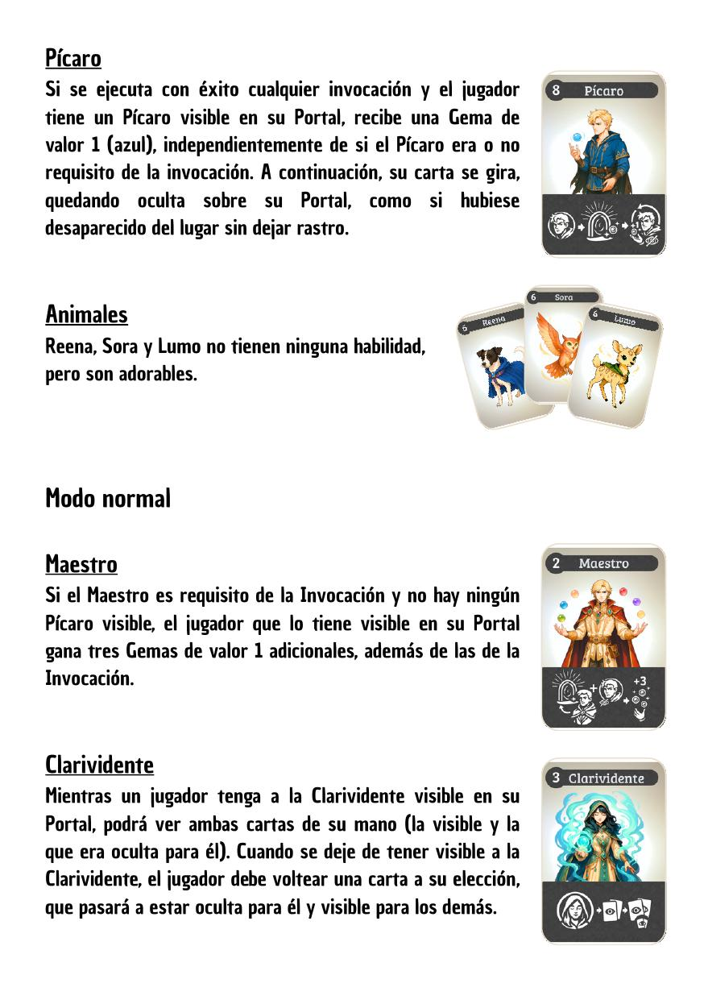

**Pícaro** — Si se ejecuta con éxito cualquier invocación y el jugador tiene
un Pícaro visible en su Portal, recibe una Gema de valor 1 (azul),
independientemente de si el Pícaro era o no requisito de la invocación. A
continuación, su carta se gira, quedando oculta sobre su Portal, como si
hubiese desaparecido del lugar sin dejar rastro.

**Animales** — Reena, Sora y Lumo no tienen ninguna habilidad, pero son
adorables.

### Modo normal

**Maestro** — Si el Maestro es requisito de la Invocación y no hay ningún
Pícaro visible **en toda la mesa**, el jugador que lo tiene visible en su
Portal gana tres Gemas de valor 1 adicionales, además de las de la
Invocación.

**Clarividente** — Mientras un jugador tenga a la Clarividente visible en su
Portal, podrá ver ambas cartas de su mano (la visible y la que era oculta
para él). Cuando se deje de tener visible a la Clarividente, el jugador debe
voltear una carta a su elección, que pasará a estar oculta para él y visible
para los demás.

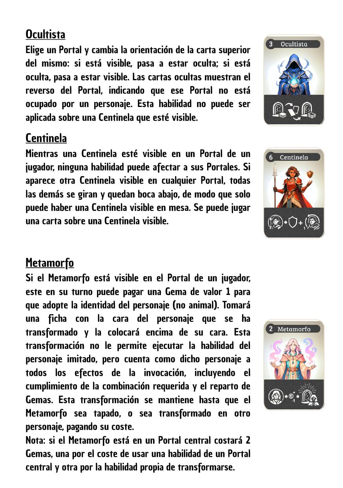

**Ocultista** — Elige un Portal y cambia la orientación de la carta superior
del mismo: si está visible, pasa a estar oculta; si está oculta, pasa a
estar visible. Las cartas ocultas muestran el reverso del Portal, indicando
que ese Portal no está ocupado por un personaje. Esta habilidad no puede ser
aplicada sobre una Centinela que esté visible.

**Centinela** — Mientras una Centinela esté visible en un Portal de un
jugador, ninguna habilidad puede afectar a sus Portales. Si aparece otra
Centinela visible en cualquier Portal, todas las demás se giran y quedan
boca abajo, de modo que solo puede haber una Centinela visible en mesa. Se
puede jugar una carta sobre una Centinela visible.

**Metamorfo** — Si el Metamorfo está visible en el Portal de un jugador,
este en su turno puede pagar una Gema para que adopte la identidad del
personaje (no animal) restante necesario para llevar a cabo la invocación
activa. Esta transformación no le permite ejecutar la habilidad del
personaje imitado, pero cuenta como dicho personaje a todos los efectos de
la invocación, incluyendo el cumplimiento de la combinación requerida y el
reparto de Gemas. Solo puede transformarse si su presencia hace posible
completar la invocación.

> **Nota:** si el Metamorfo está en un Portal central costará 2 Gemas, una
> por el coste de usar una habilidad de un Portal central y otra por la
> habilidad propia de transformarse.

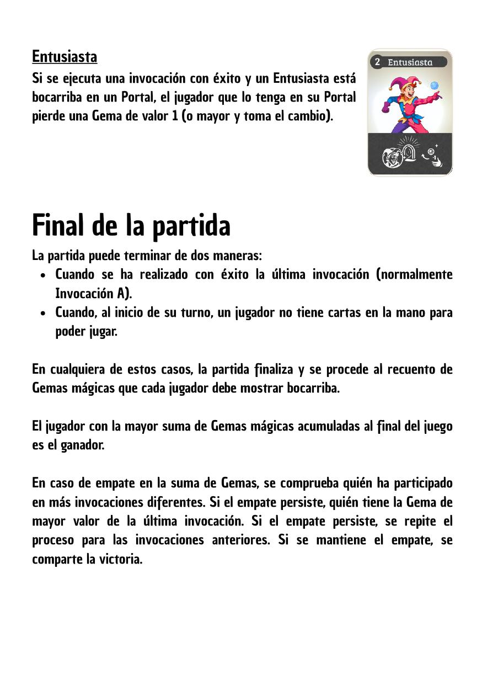

**Entusiasta** *(expansión, ver [Variantes](#variantes-y-modos-de-juego))* —
Si se ejecuta una invocación con éxito y un Entusiasta está bocarriba en un
Portal, el jugador que lo tenga en su Portal pierde una Gema de valor 1 (o
mayor y toma el cambio).

---

## Final de la partida

La partida puede terminar de dos maneras:

- Cuando se ha realizado con éxito la última invocación (normalmente
  Invocación A).
- Cuando, al inicio de su turno, un jugador no tiene cartas en la mano para
  poder jugar.

En cualquiera de estos casos, la partida finaliza y se procede al recuento
de Gemas mágicas que cada jugador debe mostrar bocarriba.

El jugador con la mayor suma de Gemas mágicas acumuladas al final del juego
es el ganador.

En caso de empate en la suma de Gemas, se comprueba quién ha participado en
más invocaciones diferentes. Si el empate persiste, quién tiene la Gema de
mayor valor de la última invocación. Si el empate persiste, se repite el
proceso para las invocaciones anteriores. Si se mantiene el empate, se
comparte la victoria.

---

## Variantes y modos de juego

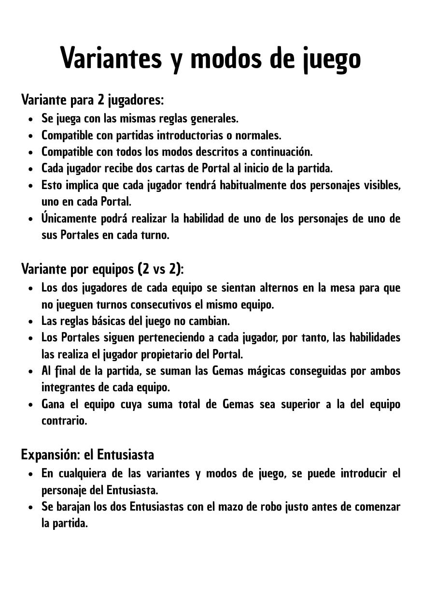

### Variante para 2 jugadores

- Se juega con las mismas reglas generales.
- Compatible con partidas introductorias o normales, y con todos los modos
  descritos a continuación.
- Cada jugador recibe dos cartas de Portal al inicio de la partida, por lo
  que tendrá habitualmente dos personajes visibles, uno en cada Portal.
- Únicamente podrá realizar la habilidad de uno de los personajes de uno de
  sus Portales en cada turno.

### Variante por equipos (2 vs 2)

- Los dos jugadores de cada equipo se sientan alternos en la mesa para que
  no jueguen turnos consecutivos el mismo equipo.
- Las reglas básicas del juego no cambian. Los Portales siguen perteneciendo
  a cada jugador, por tanto, las habilidades las realiza el jugador
  propietario del Portal.
- Al final de la partida, se suman las Gemas mágicas conseguidas por ambos
  integrantes de cada equipo. Gana el equipo cuya suma total de Gemas sea
  superior a la del equipo contrario.

### Expansión: el Entusiasta

- En cualquiera de las variantes y modos de juego, se puede introducir el
  personaje del Entusiasta.
- Se barajan los dos Entusiastas con el mazo de robo justo antes de comenzar
  la partida.

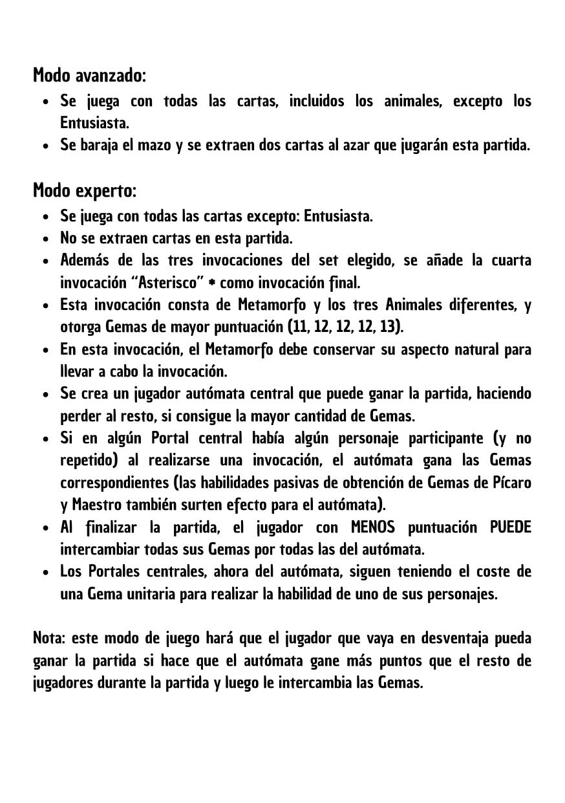

### Modo avanzado

- Se juega con todas las cartas excepto: Entusiasta.
- Se extraen los dos Metamorfos del mazo.
- El resto del mazo se baraja y se eliminan del juego cuatro cartas al azar
  (que se devuelven a la caja sin mirarlas).
- Se reincorporan los dos Metamorfos al mazo y se vuelve a barajar.

### Modo experto

- Se juega con todas las cartas excepto: Entusiasta.
- Además de las tres invocaciones del set elegido, se añade la cuarta
  invocación \* como invocación final.
- Esta invocación consta de Metamorfo y los tres Animales diferentes, y
  otorga Gemas de mayor puntuación (11, 12, 12, 12, 13). En esta invocación,
  el Metamorfo debe conservar su aspecto natural para llevar a cabo la
  invocación.
- Se crea un jugador autómata central que puede ganar la partida, haciendo
  perder al resto, si consigue la mayor cantidad de Gemas.
- Si en algún Portal central había algún personaje participante (y no
  repetido) al realizarse una invocación, el autómata gana las Gemas
  correspondientes (las habilidades de Pícaro y Maestro también surten
  efecto para el autómata).
- Al finalizar la partida, el jugador con MENOS puntuación PUEDE
  intercambiar todas sus Gemas por todas las del autómata.
- Los Portales centrales, ahora del autómata, siguen teniendo el coste de
  una Gema unitaria para realizar la habilidad de uno de sus personajes.

> **Nota:** este modo de juego hará que el jugador que vaya en desventaja
> pueda ganar la partida si hace que el autómata gane más puntos que el
> resto de jugadores durante la partida.

---

## Glosario

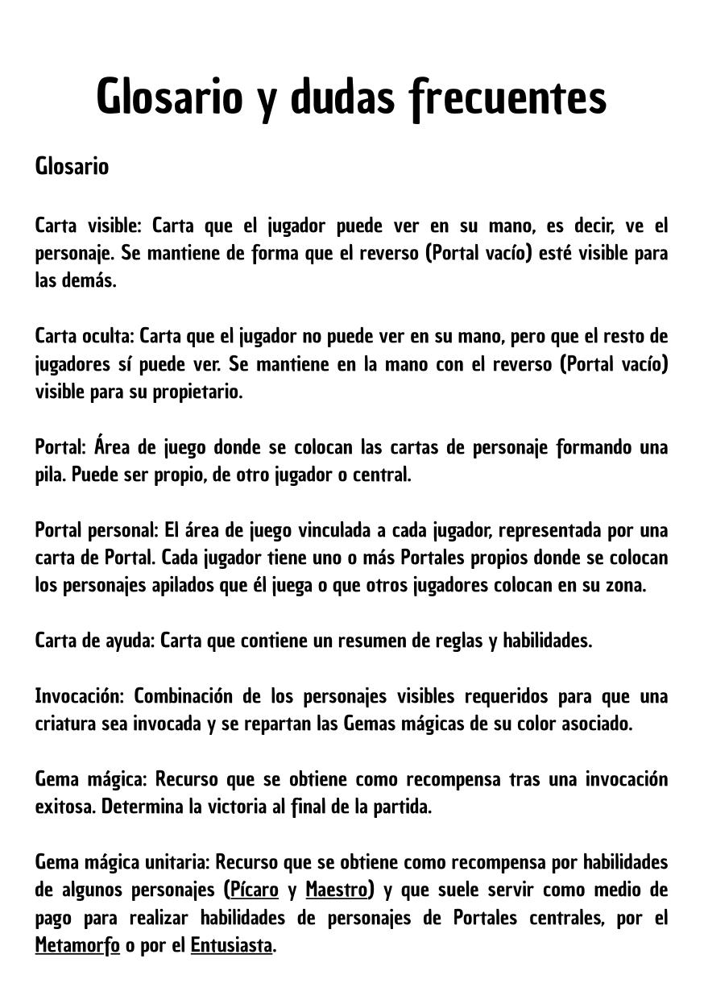

**Carta visible** — Carta que el jugador puede ver en su mano, es decir, ve
el personaje. Se mantiene de forma que el reverso (Portal vacío) esté
visible para las demás.

**Carta oculta** — Carta que el jugador no puede ver en su mano, pero que el
resto de jugadores sí puede ver. Se mantiene en la mano con el reverso
(Portal vacío) visible para su propietario.

**Portal** — Área de juego donde se colocan las cartas de personaje formando
una pila. Puede ser propio, de otro jugador o central.

**Portal personal** — El área de juego vinculada a cada jugador,
representada por una carta de Portal. Cada jugador tiene uno o más Portales
propios donde se colocan los personajes apilados que él juega o que otros
jugadores colocan en su zona.

**Carta de ayuda** — Carta que contiene un resumen de reglas y habilidades.

**Invocación** — Combinación de los personajes visibles requeridos para que
una criatura sea invocada y se repartan las Gemas mágicas de su color
asociado.

**Gema mágica** — Recurso que se obtiene como recompensa tras una invocación
exitosa. Determina la victoria al final de la partida.

**Gema mágica unitaria** — Recurso que se obtiene como recompensa por
habilidades de algunos personajes (Pícaro y Maestro) y que suele servir como
medio de pago para realizar habilidades de personajes de Portales
centrales, por el Metamorfo o por el Entusiasta.

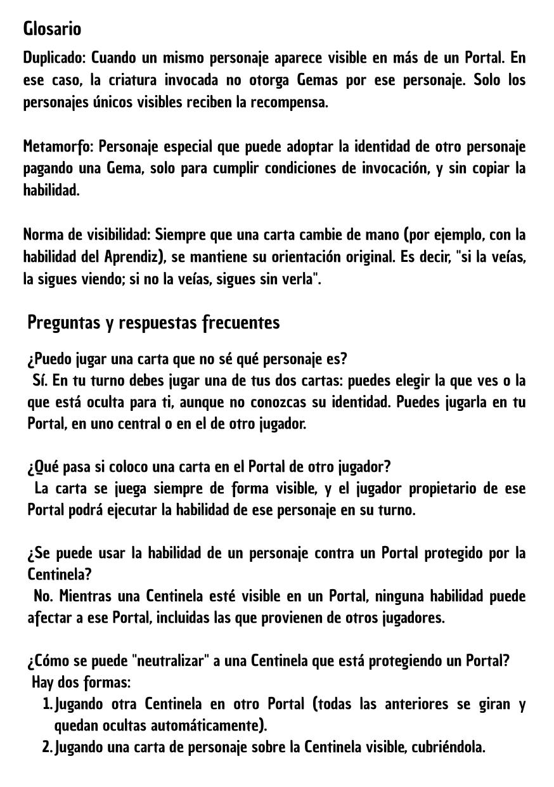

**Duplicado** — Cuando un mismo personaje aparece visible en más de un
Portal. En ese caso, la criatura invocada no otorga Gemas por ese personaje.
Solo los personajes únicos visibles reciben la recompensa.

**Metamorfo** — Personaje especial que puede adoptar la identidad de otro
personaje pagando una Gema, solo para cumplir condiciones de invocación, y
sin copiar la habilidad.

**Norma de visibilidad** — Siempre que una carta cambie de mano (por
ejemplo, con la habilidad del Aprendiz), se mantiene su orientación
original. Es decir, "si la veías, la sigues viendo; si no la veías, sigues
sin verla".

---

## Preguntas y respuestas frecuentes

**¿Puedo jugar una carta que no sé qué personaje es?**
Sí. En tu turno debes jugar una de tus dos cartas: puedes elegir la que ves
o la que está oculta para ti, aunque no conozcas su identidad. Puedes
jugarla en tu Portal, en uno central o en el de otro jugador.

**¿Qué pasa si coloco una carta en el Portal de otro jugador?**
La carta se juega siempre de forma visible, y el jugador propietario de ese
Portal podrá ejecutar la habilidad de ese personaje en su turno.

**¿Se puede usar la habilidad de un personaje contra un Portal protegido por
la Centinela?**
No. Mientras una Centinela esté visible en un Portal, ninguna habilidad
puede afectar a ese Portal, incluidas las que provienen de otros jugadores.

**¿Cómo se puede "neutralizar" a una Centinela que está protegiendo un
Portal?**
Hay dos formas: (1) jugando otra Centinela en otro Portal (todas las
anteriores se giran y quedan ocultas automáticamente); (2) jugando una carta
de personaje sobre la Centinela visible, cubriéndola.

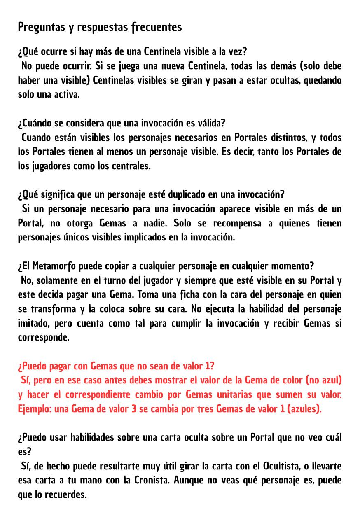

**¿Qué ocurre si hay más de una Centinela visible a la vez?**
No puede ocurrir. Si se juega una nueva Centinela, todas las demás Centinelas
visibles se giran y pasan a estar ocultas, quedando solo una activa.

**¿Cuándo se considera que una invocación es válida?**
Cuando están visibles los personajes necesarios en Portales distintos, y
todos los Portales tienen al menos un personaje visible. Es decir, tanto los
Portales de los jugadores como los centrales.

**¿Qué significa que un personaje esté duplicado en una invocación?**
Si un personaje necesario para una invocación aparece visible en más de un
Portal, no otorga Gemas a nadie. Solo se recompensa a quienes tienen
personajes únicos visibles implicados en la invocación.

**¿El Metamorfo puede copiar a cualquier personaje en cualquier momento?**
No, solamente en el turno del jugador y siempre que esté visible en su
Portal y este decida pagar una Gema. Solo puede transformarse si con ello se
completa una invocación activa. No ejecuta la habilidad del personaje
imitado, pero cuenta como tal para cumplir la invocación y recibir Gemas si
corresponde.

**¿Puedo pagar con Gemas que no sean de valor 1?**
Sí, pero en ese caso antes debes mostrar el valor de la Gema de color (no
azul) y hacer el correspondiente cambio por Gemas unitarias que sumen su
valor. Ejemplo: una Gema de valor 3 se cambia por tres Gemas de valor 1
(azules).

**¿Puedo usar habilidades sobre una carta oculta sobre un Portal que no veo
cuál es?**
Sí, de hecho puede resultarte muy útil girar la carta con el Ocultista, o
llevarte esa carta a tu mano con la Cronista. Aunque no veas qué personaje
es, puede que lo recuerdes.

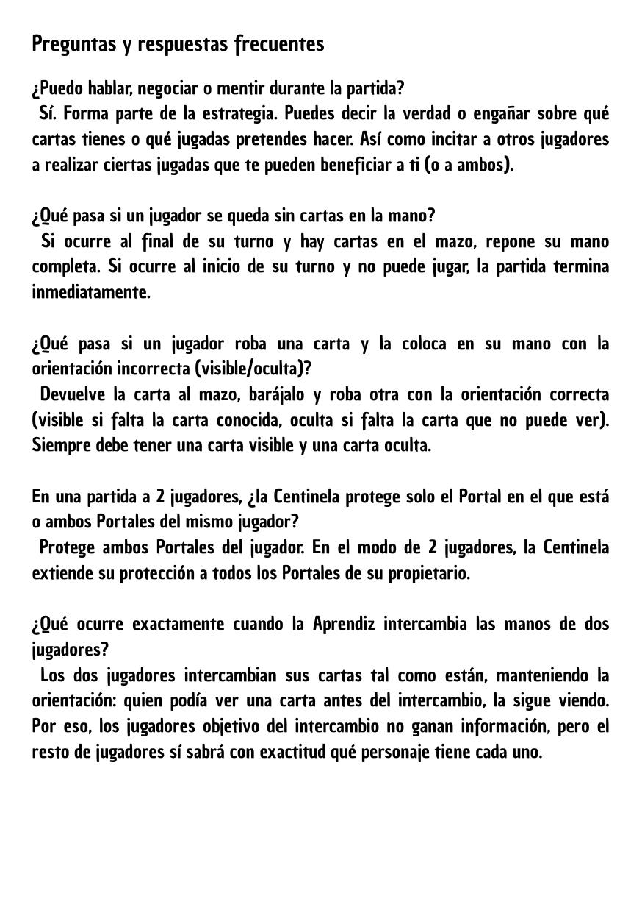

**¿Puedo hablar, negociar o mentir durante la partida?**
Sí. Forma parte de la estrategia. Puedes decir la verdad o engañar sobre qué
cartas tienes o qué jugadas pretendes hacer. Así como incitar a otros
jugadores a realizar ciertas jugadas que te pueden beneficiar a ti (o a
ambos).

**¿Qué pasa si un jugador se queda sin cartas en la mano?**
Si ocurre al final de su turno y hay cartas en el mazo, repone su mano
completa. Si ocurre al inicio de su turno y no puede jugar, la partida
termina inmediatamente.

**¿Qué pasa si un jugador roba una carta y la coloca en su mano con la
orientación incorrecta (visible/oculta)?**
Devuelve la carta al mazo, barájalo y roba otra con la orientación correcta
(visible si falta la carta conocida, oculta si falta la carta que no puede
ver). Siempre debe tener una carta visible y una carta oculta.

**En una partida a 2 jugadores, ¿la Centinela protege solo el Portal en el
que está o ambos Portales del mismo jugador?**
Protege ambos Portales del jugador. En el modo de 2 jugadores, la Centinela
extiende su protección a todos los Portales de su propietario.

**¿Qué ocurre exactamente cuando la Aprendiz intercambia las manos de dos
jugadores?**
Los dos jugadores intercambian sus cartas tal como están, manteniendo la
orientación: quien podía ver una carta antes del intercambio, la sigue
viendo. Por eso, los jugadores objetivo del intercambio no ganan
información, pero el resto de jugadores sí sabrá con exactitud qué
personaje tiene cada uno.
